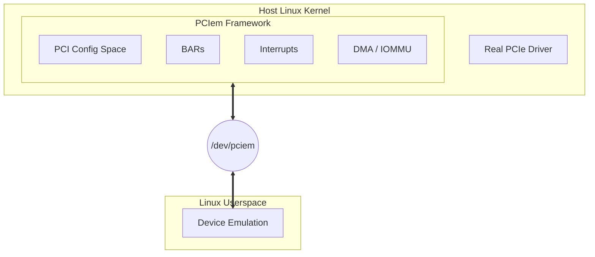

# Overview

PCIem is a Linux framework that enables software developers to write PCIe card drivers on the host to target unexisting PCIe cards on the bus.

This helps model a driver if the developers don't have a physical PCIe card to test it on, effectively enabling pre-silicon engineering on the
software side of things for the prototype card.

Initially, PCIem was thought after enabling communications from/to a QEMU instance; but has ever since been evolving to support a wide variety
of use-cases.

You can think of the framework as a MITM (Man-in-the-Middle) that sits between the untouched, production drivers (Which are, unaware of PCIem's
existence) and the Linux kernel.

